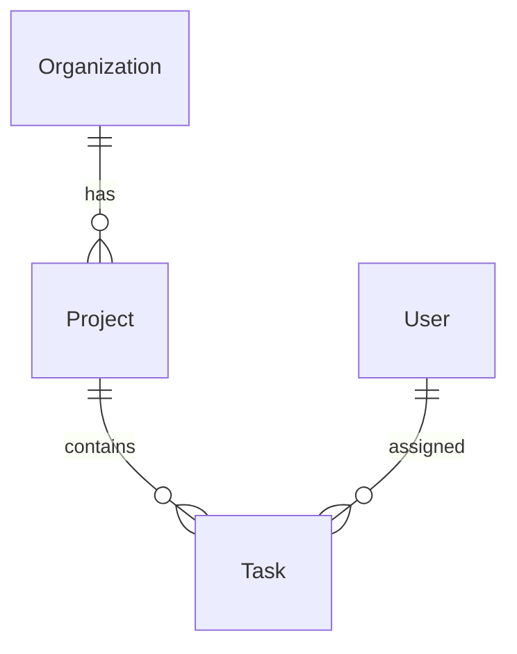

# /schema

Design or update your multi-tenant database schema.

---

## Usage

```
/schema
```

Or with specific entities:

```
/schema

Design a schema for:
- Projects (name, description, status)
- Tasks (title, priority, assigned_to)
```

---

## What It Does

The `/schema` command invokes the **schema-architect** skill to:

1. **Analyze Requirements**
   - Reviews discovery document (if exists)
   - Reviews Gherkin scenarios (if exists)
   - Identifies entities and relationships

2. **Design Multi-Tenant Schema**
   - Organization as tenant root
   - Row-level data isolation
   - Proper foreign key relationships
   - Indexes for query performance

3. **Generate Artifacts**
   - `backend/.apsorc` - Schema definition
   - `docs/plans/schema-design.md` - Documentation
   - Entity relationship diagram (Mermaid)

---

## Output Example

### .apsorc

```json
{
  "name": "my-saas",
  "entities": [
    {
      "name": "Project",
      "fields": [
        { "name": "name", "type": "string", "required": true },
        { "name": "description", "type": "text" },
        { "name": "status", "type": "enum", "values": ["active", "archived"] }
      ],
      "relationships": [
        { "type": "belongsTo", "entity": "Organization" },
        { "type": "hasMany", "entity": "Task" }
      ]
    }
  ]
}
```

### ERD Diagram



---

## Prerequisites

For best results, have:

- Discovery document (`docs/discovery/discovery-notes.md`)
- OR Gherkin scenarios (`docs/scenarios/*.feature`)
- OR clear entity descriptions

---

## Multi-Tenancy

All entities automatically include:

- `organizationId` - Foreign key to Organization
- Row-level isolation enforced
- Queries scoped to current organization

---

## After Schema

Next steps:

1. **Review schema** - Verify entities match requirements
2. **Run `/tests`** - Generate test scenarios
3. **Run `/plan`** - Create technical plan
4. **Bootstrap backend** - Use orchestrator or backend-bootstrapper

---

## See Also

- [Schema Architect](../skills/schema-architect.md) - Full skill reference
- [/tests](tests.md) - Generate test scenarios
