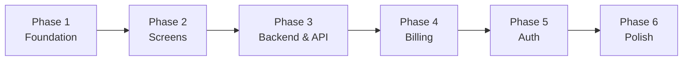

# Implementation Phases

The standard approach for building applications after discovery and planning.

---

## The Core Principle

!!! tip "Screens First, Auth Last"
    Build all UI screens with mock data first, wire up the backend, add billing, then seal with authentication. This approach enables:

    - **Faster UI iteration** without auth overhead
    - **Parallel frontend/backend development**
    - **Earlier stakeholder feedback** on UX
    - **Auth as a "seal"** rather than a blocker

---

## Phase Overview



| Phase | Focus | Auth Required | Duration |
|-------|-------|---------------|----------|
| **Phase 1** | Foundation & Layout | No | 1-2 weeks |
| **Phase 2** | All Screens (mock data) | No | 3-6 weeks |
| **Phase 3** | Backend Schema & API | No | 3-6 weeks |
| **Phase 4** | Billing & Payments | No | 2-3 weeks |
| **Phase 5** | Authentication | Yes | 2-3 weeks |
| **Phase 6** | Polish & QA | Yes | 2-4 weeks |

---

## Phase 1: Foundation & Layout

**Goal:** Project scaffolding with layout and navigation working (no auth)

### Deliverables

- [ ] Next.js project initialization (from devenv template)
- [ ] Tailwind CSS + shadcn/ui setup
- [ ] Design system (colors, typography, spacing)
- [ ] Layout components:
    - `GlobalNav` - Primary navigation (sidebar/topbar)
    - `AppLayout` - Main wrapper with nav
    - `EntityLayout` - Detail page wrapper
    - `EntityHeader` - Breadcrumbs + actions
    - `EntityTabs` - Sub-navigation
- [ ] Route structure (all pages as shells)
- [ ] Navigation working end-to-end
- [ ] Responsive foundation (mobile/tablet/desktop)

### Exit Criteria

!!! success "Phase 1 Complete When"
    - All routes exist and return 200
    - Navigation works between all pages
    - Layout components are reusable
    - Design system tokens are defined

---

## Phase 2: Screen Build-Out

**Goal:** All screens exist with UI components using mock data

### Approach

1. **Create mock data files** - TypeScript interfaces + sample data
2. **Build list pages** - Tables, filters, search, pagination
3. **Build detail pages** - Forms, tabs, related data
4. **Build action modals** - Create/edit/delete flows
5. **Build specialized UIs** - Dashboards, charts, custom components

### Mock Data Pattern

```typescript
// src/lib/mock-data/users.ts
import { User } from '@/types/user';

export const mockUsers: User[] = [
  {
    id: '1',
    name: 'John Doe',
    email: 'john@example.com',
    role: 'admin',
    createdAt: new Date('2024-01-15'),
  },
  // ... more mock data
];

export function getMockUser(id: string): User | undefined {
  return mockUsers.find(u => u.id === id);
}
```

### Page Building Order

1. **List pages** - Primary navigation destinations
2. **Detail pages** - Entity profiles/dashboards
3. **Form pages** - Create/edit flows
4. **Settings pages** - Configuration screens
5. **Special pages** - Dashboards, reports, workflows

### Exit Criteria

!!! success "Phase 2 Complete When"
    - Every route has a functional UI
    - All CRUD operations have UI (with mock handlers)
    - Forms have validation (client-side)
    - Empty states and loading states exist
    - Responsive layouts work on all breakpoints

---

## Phase 3: Backend Schema & API Integration

**Goal:** Real data flowing through Apso RC backend

### Step 1: Schema Design

Define the `.apsorc` schema based on discovery artifacts:

```json
{
  "service": "my-app-api",
  "entities": {
    "Organization": {
      "fields": {
        "id": { "type": "uuid", "primary": true },
        "name": { "type": "string", "required": true },
        "slug": { "type": "string", "unique": true }
      }
    },
    "User": {
      "fields": {
        "id": { "type": "uuid", "primary": true },
        "email": { "type": "string", "unique": true },
        "organization_id": {
          "type": "uuid",
          "references": "Organization.id"
        }
      }
    }
  }
}
```

### Step 2: API Client Setup

```typescript
// src/lib/api/client.ts
import { QueryClient } from '@tanstack/react-query';

export const queryClient = new QueryClient({
  defaultOptions: {
    queries: {
      staleTime: 5 * 60 * 1000, // 5 minutes
      retry: 1,
    },
  },
});

// src/lib/api/users.ts
export async function getUsers(orgId: string): Promise<User[]> {
  const response = await fetch(`/api/organizations/${orgId}/users`);
  if (!response.ok) throw new Error('Failed to fetch users');
  return response.json();
}

export function useUsers(orgId: string) {
  return useQuery({
    queryKey: ['users', orgId],
    queryFn: () => getUsers(orgId),
  });
}
```

### Step 3: Replace Mock Data

Systematically replace mock data with API calls:

1. Create API functions for each entity
2. Create React Query hooks
3. Update components to use hooks
4. Test each page with real data
5. Handle loading/error states

### Exit Criteria

!!! success "Phase 3 Complete When"
    - All entities exist in Apso schema
    - All list pages fetch from API
    - All CRUD operations work
    - Relationships are correct
    - No mock data remains in production code

---

## Phase 4: Billing & Payments

**Goal:** Stripe integration for monetization

### SaaS Billing (Your Product)

- [ ] Stripe account setup
- [ ] Plan/pricing configuration
- [ ] Checkout flow
- [ ] Subscription management
- [ ] Customer portal integration
- [ ] Webhook handling
- [ ] Usage tracking (if applicable)

### In-App Billing (If Applicable)

Some apps need billing within the product (e.g., healthcare invoicing):

- [ ] Invoice generation
- [ ] Payment recording
- [ ] Payment method storage
- [ ] Billing reports

### Webhook Events to Handle

```typescript
// Required webhooks
customer.subscription.created
customer.subscription.updated
customer.subscription.deleted
invoice.payment_succeeded
invoice.payment_failed
checkout.session.completed
```

### Exit Criteria

!!! success "Phase 4 Complete When"
    - Users can subscribe/upgrade/downgrade
    - Payments process correctly
    - Subscription status reflects in app
    - Cancellation flow works
    - Invoice history accessible

---

## Phase 5: Authentication

**Goal:** Secure the app with BetterAuth (multi-tenant)

!!! info "Why Auth Last?"
    Authentication is the "seal" on your application. By implementing it last:

    - UI development isn't blocked by auth flows
    - Backend can be tested without auth overhead
    - Auth implementation is cleaner (you know all protected routes)
    - User experience is designed first, then protected

### BetterAuth Setup

1. Configure BetterAuth with Apso adapter
2. Set up session management
3. Add OAuth providers (Google, GitHub, etc.)
4. Implement protected route middleware

### Auth UI Pages

- [ ] Login page (email + OAuth buttons)
- [ ] Signup page
- [ ] Email verification
- [ ] Password reset flow
- [ ] Accept invitation flow

### Multi-Tenant Auth

For multi-tenant apps:

- [ ] Organization creation on signup
- [ ] Organization invitation flow
- [ ] Organization switcher UI
- [ ] Role-based permissions per org

### Protected Routes

```typescript
// middleware.ts
import { auth } from '@/lib/auth';

export default auth((req) => {
  const isLoggedIn = !!req.auth;
  const isPublicRoute = publicRoutes.includes(req.nextUrl.pathname);

  if (!isLoggedIn && !isPublicRoute) {
    return Response.redirect(new URL('/login', req.nextUrl));
  }
});
```

### Exit Criteria

!!! success "Phase 5 Complete When"
    - All protected routes require authentication
    - Login/signup/logout work correctly
    - OAuth providers function
    - Session management is secure
    - Multi-tenant isolation verified (if applicable)

---

## Phase 6: Polish & QA

**Goal:** Production readiness

### Error Handling

- [ ] Error boundaries on all major sections
- [ ] API error handling with user-friendly messages
- [ ] Offline support / retry logic
- [ ] 404 and 500 pages

### Loading States

- [ ] Skeleton loaders for all lists
- [ ] Progress indicators for long operations
- [ ] Optimistic updates where appropriate

### Empty States

- [ ] Designed empty states for all lists
- [ ] First-run / onboarding experience
- [ ] Zero-data scenarios

### Performance

- [ ] React Query cache optimization
- [ ] Code splitting / lazy loading
- [ ] Image optimization
- [ ] Bundle size analysis

### Testing

- [ ] Unit tests for critical logic
- [ ] Integration tests for API flows
- [ ] E2E tests for happy paths
- [ ] Manual QA checklist

### Accessibility

- [ ] Keyboard navigation
- [ ] Screen reader testing
- [ ] Color contrast verification
- [ ] Focus management

### Exit Criteria

!!! success "Phase 6 Complete When"
    - No console errors in production
    - Core flows pass E2E tests
    - Performance metrics acceptable
    - Accessibility audit passed
    - Security review completed

---

## Parallel Work Opportunities

Some phases can overlap:

```
Week 1-2:  Phase 1 (Foundation)
Week 2-6:  Phase 2 (Screens) + Phase 3 begins (Schema Design)
Week 4-8:  Phase 3 (API Integration)
Week 6-9:  Phase 4 (Billing) - can start before Phase 3 completes
Week 8-10: Phase 5 (Auth)
Week 9-12: Phase 6 (Polish) - overlaps with Auth completion
```

### Team Parallelization

| Team Member | Phase 1-2 | Phase 3 | Phase 4-5 | Phase 6 |
|-------------|-----------|---------|-----------|---------|
| Frontend Dev | Foundation + Screens | API Integration | Auth UI | Polish |
| Backend Dev | Schema Support | Apso Setup | Billing APIs | Testing |
| Designer | Design System | - | - | QA |

---

## Common Pitfalls

!!! warning "Avoid These Mistakes"

    **Starting with Auth**
    : Blocks all other development. Auth is a "seal", not a foundation.

    **Skipping Mock Data**
    : Makes UI development dependent on backend. Mock data enables parallel work.

    **Not Defining Empty States**
    : Users see broken-looking pages. Design empty states during Phase 2.

    **Premature Optimization**
    : Polish comes last. Get it working, then make it fast.

    **Ignoring Mobile**
    : Responsive layout in Phase 1, not Phase 6. It's harder to retrofit.

---

## Next Steps

- [Workflow Overview](workflow.md) - Planning phases before implementation
- [Project Structure](project-structure.md) - Directory organization
- [Backend Bootstrapper](../skills/backend-bootstrapper.md) - Apso setup
- [Auth Bootstrapper](../skills/auth-bootstrapper.md) - BetterAuth setup
