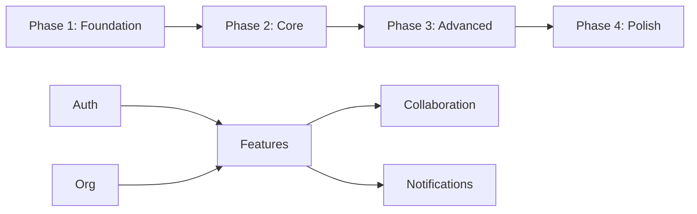

# Development Roadmap: [PROJECT_NAME]

**Created:** [DATE]
**Last Updated:** [DATE]
**Status:** Planning | In Progress | Complete

---

## Overview

| Metric | Value |
|--------|-------|
| Total Phases | [NUMBER] |
| Total Scenarios | [NUMBER] |
| Estimated Duration | [WEEKS] weeks |
| MVP Target | Phase [X] |

---

## Phase Summary

```
Phase 1: Foundation     ████████░░░░░░░░░░░░  Week 1-2
Phase 2: Core Features  ░░░░░░░░░░░░░░░░░░░░  Week 3-5
Phase 3: Advanced       ░░░░░░░░░░░░░░░░░░░░  Week 6-8
Phase 4: Polish         ░░░░░░░░░░░░░░░░░░░░  Week 9-10
```

---

## Phase 1: Foundation

**Duration:** Weeks 1-2
**Objective:** Core infrastructure and authentication
**Exit Criteria:** Users can authenticate and manage organizations

### Deliverables

#### 1.1 Project Setup
- [ ] Initialize project structure (`/init`)
- [ ] Configure backend (Apso)
- [ ] Configure frontend (Next.js)
- [ ] Set up development environment
- [ ] Configure CI/CD pipeline

**Scenarios:** 0 (infrastructure)

#### 1.2 Authentication
- [ ] User registration
- [ ] Email verification
- [ ] User login
- [ ] Password reset
- [ ] Session management
- [ ] Logout

**Scenarios:** 15-18
**Feature Files:**
- `features/api/auth/registration.feature`
- `features/api/auth/login.feature`
- `features/ui/auth/forms.feature`
- `features/e2e/auth/flow.feature`

#### 1.3 Organization Management
- [ ] Create organization
- [ ] Organization settings
- [ ] Organization switching (if multi-org)

**Scenarios:** 6-8
**Feature Files:**
- `features/api/organization/crud.feature`
- `features/ui/organization/settings.feature`

#### 1.4 User Profile
- [ ] View profile
- [ ] Edit profile
- [ ] Change password
- [ ] Account deletion

**Scenarios:** 5-6
**Feature Files:**
- `features/api/user/profile.feature`
- `features/ui/user/profile.feature`

### Phase 1 Totals

| Metric | Target |
|--------|--------|
| Scenarios | 26-32 |
| API Tests | 15-18 |
| UI Tests | 8-10 |
| E2E Tests | 3-4 |

---

## Phase 2: Core Features

**Duration:** Weeks 3-5
**Objective:** Primary business functionality
**Exit Criteria:** Core workflows functional and tested

### Deliverables

#### 2.1 [FEATURE_1] Management
- [ ] Create [ENTITY]
- [ ] View [ENTITY] list
- [ ] View [ENTITY] details
- [ ] Edit [ENTITY]
- [ ] Delete [ENTITY]
- [ ] [ENTITY] search/filter

**Scenarios:** 12-15
**Feature Files:**
- `features/api/[entity]/crud.feature`
- `features/ui/[entity]/list.feature`
- `features/ui/[entity]/form.feature`
- `features/e2e/[entity]/workflow.feature`

#### 2.2 [FEATURE_2] Management
- [ ] [DELIVERABLE_1]
- [ ] [DELIVERABLE_2]
- [ ] [DELIVERABLE_3]

**Scenarios:** 10-12
**Feature Files:**
- `features/api/[entity]/crud.feature`
- `features/ui/[entity]/components.feature`

#### 2.3 [FEATURE_3] Workflows
- [ ] [WORKFLOW_1]
- [ ] [WORKFLOW_2]

**Scenarios:** 8-10
**Feature Files:**
- `features/api/[workflow]/process.feature`
- `features/e2e/[workflow]/complete.feature`

### Phase 2 Totals

| Metric | Target |
|--------|--------|
| Scenarios | 30-37 |
| API Tests | 18-22 |
| UI Tests | 10-12 |
| E2E Tests | 2-3 |

---

## Phase 3: Advanced Features

**Duration:** Weeks 6-8
**Objective:** Secondary features and integrations
**Exit Criteria:** All planned features complete

### Deliverables

#### 3.1 Team Collaboration
- [ ] Invite team members
- [ ] Accept/decline invitations
- [ ] Role management
- [ ] Remove team members

**Scenarios:** 10-12

#### 3.2 Notifications
- [ ] In-app notifications
- [ ] Email notifications
- [ ] Notification preferences
- [ ] Mark as read/unread

**Scenarios:** 8-10

#### 3.3 Search & Filtering
- [ ] Global search
- [ ] Advanced filters
- [ ] Saved filters/views

**Scenarios:** 6-8

#### 3.4 [INTEGRATION] Integration
- [ ] Connect [SERVICE]
- [ ] Sync data
- [ ] Handle errors

**Scenarios:** 5-6

### Phase 3 Totals

| Metric | Target |
|--------|--------|
| Scenarios | 29-36 |
| API Tests | 16-20 |
| UI Tests | 10-12 |
| E2E Tests | 3-4 |

---

## Phase 4: Polish & Launch

**Duration:** Weeks 9-10
**Objective:** Production readiness
**Exit Criteria:** Ready for public launch

### Deliverables

#### 4.1 Testing & QA
- [ ] Fill test coverage gaps
- [ ] Performance testing
- [ ] Security audit
- [ ] Accessibility audit
- [ ] Bug fixing sprint

#### 4.2 Performance
- [ ] API optimization
- [ ] Frontend optimization
- [ ] Database indexes
- [ ] Caching layer

#### 4.3 Deployment
- [ ] Production environment
- [ ] Staging environment
- [ ] CI/CD pipeline
- [ ] Monitoring (Sentry)
- [ ] Analytics

#### 4.4 Documentation
- [ ] User documentation
- [ ] API documentation
- [ ] Deployment guide
- [ ] Runbook

### Phase 4 Totals

| Metric | Target |
|--------|--------|
| Test Coverage | 80%+ |
| Lighthouse Score | 90+ |
| Security Issues | 0 critical |

---

## Milestone Summary

| Milestone | Date | Criteria |
|-----------|------|----------|
| Phase 1 Complete | Week 2 | Auth working, 26+ scenarios pass |
| Phase 2 Complete | Week 5 | Core features working, 56+ scenarios pass |
| Phase 3 Complete | Week 8 | All features working, 85+ scenarios pass |
| MVP Ready | Week 10 | 80%+ coverage, production deployed |

---

## Risk Mitigation

| Risk | Probability | Mitigation |
|------|-------------|------------|
| Scope creep | High | Strict phase gates, MVP protection |
| Technical blockers | Medium | Early spike on unknowns |
| Integration delays | Medium | Mock integrations for Phase 2 |

---

## Dependencies



---

## Progress Tracking

### Current Status

**Phase:** [1/2/3/4]
**Week:** [X] of [TOTAL]
**Scenarios Passing:** [X] of [TOTAL]

### Recent Completions
- [DATE]: [MILESTONE]
- [DATE]: [MILESTONE]

### Blockers
- [ ] [BLOCKER_1]
- [ ] [BLOCKER_2]

---

**Last Updated:** [DATE]
