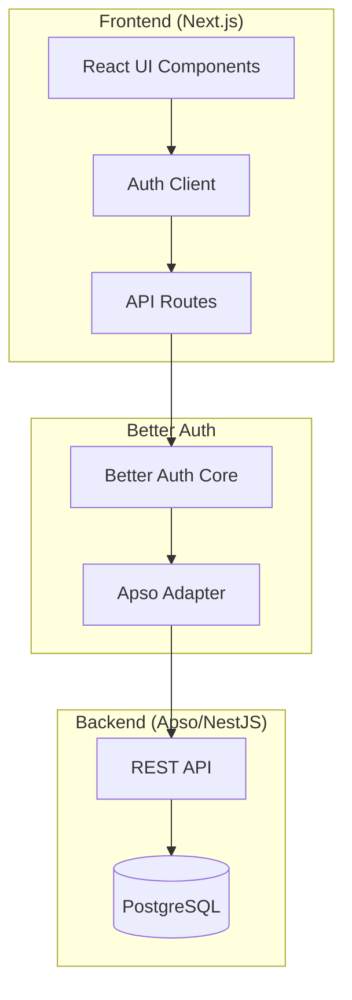
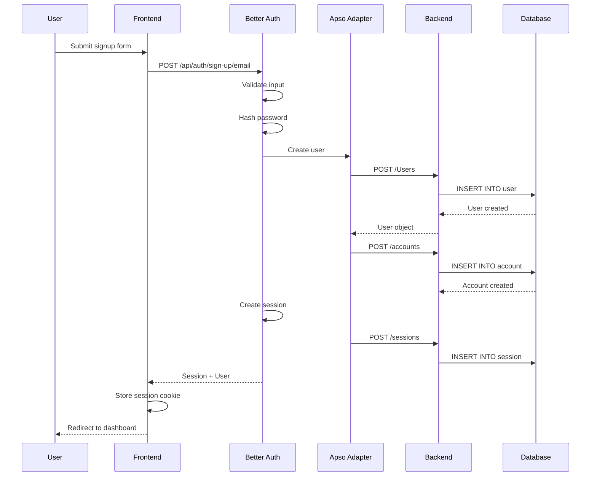
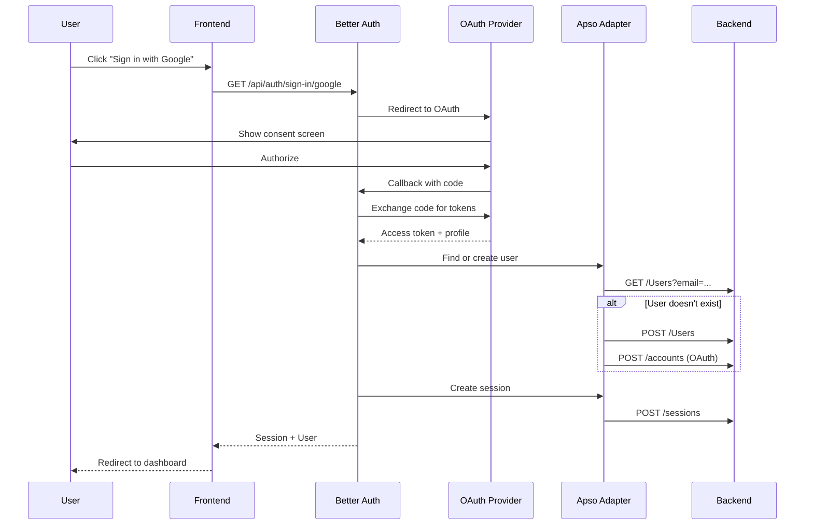

# Complete Better Auth + Apso Integration Guide

> Comprehensive documentation for implementing authentication in Apso-based SaaS applications

## Table of Contents

1. [Architecture Overview](#architecture-overview)
2. [Entity Design & Naming Strategy](#entity-design--naming-strategy)
3. [Step-by-Step Implementation](#step-by-step-implementation)
4. [Backend Configuration](#backend-configuration)
5. [Frontend Integration](#frontend-integration)
6. [Authentication Workflows](#authentication-workflows)
7. [Multi-Tenancy & Organization Management](#multi-tenancy--organization-management)
8. [Troubleshooting Guide](#troubleshooting-guide)
9. [Production Checklist](#production-checklist)
10. [Reference Implementation](#reference-implementation)

## Architecture Overview

### System Components



### Data Flow

1. **User Registration/Login** → Frontend form
2. **Better Auth Processing** → Validates and processes auth request
3. **Apso Adapter** → Translates to REST API calls
4. **Backend CRUD** → Stores/retrieves from PostgreSQL
5. **Session Management** → Returns tokens/sessions to frontend

## Entity Design & Naming Strategy

### Critical: Reserved Entity Names

Better Auth **requires** these exact entity names (case-sensitive):

| Entity | Case | Purpose | Required Fields |
|--------|------|---------|-----------------|
| `User` | PascalCase | User accounts | email, name, password_hash* |
| `account` | lowercase | OAuth/credentials | userId, providerId, accountId |
| `session` | lowercase | Active sessions | sessionToken, userId, expiresAt |
| `verification` | lowercase | Email verification | identifier, value, expiresAt |

### Business Entity Naming Conflicts

If your business domain needs "Account" or "Session", **rename them**:

| Conflict | Recommended Alternatives | Example Usage |
|----------|--------------------------|---------------|
| Account | Organization, Company, Workspace, Tenant | Multi-tenant root |
| Session | DiscoverySession, UserSession, ChatSession | Business sessions |
| User | (no conflict - User is universal) | Keep as User |

### Complete .apsorc Configuration

```json
{
  "service": "your-saas-backend",
  "database": {
    "provider": "postgresql",
    "multiTenant": true,
    "tenantKey": "organization_id"
  },
  "entities": {
    // Business Entities (renamed to avoid conflicts)
    "Organization": {
      "description": "Multi-tenant root entity (renamed from Account)",
      "fields": {
        "id": {
          "type": "uuid",
          "primary": true,
          "default": "uuid_generate_v4()"
        },
        "name": {
          "type": "string",
          "required": true,
          "maxLength": 255
        },
        "slug": {
          "type": "string",
          "unique": true,
          "required": true,
          "pattern": "^[a-z0-9-]+$"
        },
        "billing_email": {
          "type": "string",
          "required": true
        },
        "subscription_tier": {
          "type": "enum",
          "values": ["free", "starter", "professional"],
          "default": "free"
        },
        "credits": {
          "type": "integer",
          "default": 10,
          "min": 0
        },
        "created_at": {
          "type": "timestamp",
          "default": "now()"
        },
        "updated_at": {
          "type": "timestamp",
          "default": "now()"
        }
      }
    },

    // Better Auth Required Entities
    "User": {
      "description": "Authentication entity managed by Better Auth",
      "fields": {
        "id": {
          "type": "uuid",
          "primary": true,
          "default": "uuid_generate_v4()"
        },
        "email": {
          "type": "string",
          "unique": true,
          "required": true,
          "maxLength": 255
        },
        "email_verified": {
          "type": "boolean",
          "default": false
        },
        "name": {
          "type": "string",
          "required": true,
          "maxLength": 255
        },
        "avatar_url": {
          "type": "string",
          "nullable": true,  // ← CRITICAL: Must be nullable
          "maxLength": 500
        },
        "password_hash": {
          "type": "string",
          "nullable": true,  // ← CRITICAL: OAuth users won't have this
          "comment": "Only for email/password auth"
        },
        "oauth_provider": {
          "type": "enum",
          "values": ["google", "github", "microsoft"],
          "nullable": true,  // ← CRITICAL: Email users won't have this
          "comment": "OAuth provider if applicable"
        },
        "oauth_id": {
          "type": "string",
          "nullable": true,  // ← CRITICAL: Email users won't have this
          "maxLength": 255
        },
        "created_at": {
          "type": "timestamp",
          "default": "now()",
          "required": true
        },
        "updated_at": {
          "type": "timestamp",
          "default": "now()",
          "required": true
        }
      }
    },

    "account": {  // ← lowercase!
      "description": "Better Auth account entity for OAuth/credentials",
      "fields": {
        "id": {
          "type": "uuid",
          "primary": true,
          "default": "uuid_generate_v4()"
        },
        "userId": {
          "type": "uuid",
          "required": true,
          "references": "User.id",
          "onDelete": "CASCADE"
        },
        "accountId": {
          "type": "string",
          "required": true
        },
        "providerId": {
          "type": "string",
          "required": true
        },
        "accessToken": {
          "type": "string",
          "nullable": true
        },
        "refreshToken": {
          "type": "string",
          "nullable": true
        },
        "accessTokenExpiresAt": {
          "type": "timestamp",
          "nullable": true
        },
        "refreshTokenExpiresAt": {
          "type": "timestamp",
          "nullable": true
        },
        "scope": {
          "type": "string",
          "nullable": true
        },
        "idToken": {
          "type": "string",
          "nullable": true
        },
        "password": {
          "type": "string",
          "nullable": true
        },
        "created_at": {
          "type": "timestamp",
          "default": "now()"
        },
        "updated_at": {
          "type": "timestamp",
          "default": "now()"
        }
      },
      "unique": [
        ["providerId", "accountId"]
      ]
    },

    "session": {  // ← lowercase!
      "description": "Better Auth session entity",
      "fields": {
        "id": {
          "type": "uuid",
          "primary": true,
          "default": "uuid_generate_v4()"
        },
        "sessionToken": {
          "type": "string",
          "unique": true,
          "required": true
        },
        "userId": {
          "type": "uuid",
          "required": true,
          "references": "User.id",
          "onDelete": "CASCADE"
        },
        "expiresAt": {
          "type": "timestamp",
          "required": true
        },
        "created_at": {
          "type": "timestamp",
          "default": "now()"
        },
        "updated_at": {
          "type": "timestamp",
          "default": "now()"
        }
      },
      "indexes": [
        ["sessionToken"],
        ["userId"]
      ]
    },

    "verification": {  // ← lowercase!
      "description": "Better Auth email verification entity",
      "fields": {
        "id": {
          "type": "uuid",
          "primary": true,
          "default": "uuid_generate_v4()"
        },
        "identifier": {
          "type": "string",
          "required": true,
          "comment": "Email address being verified"
        },
        "value": {
          "type": "string",
          "required": true,
          "comment": "Verification token"
        },
        "expiresAt": {
          "type": "timestamp",
          "required": true
        },
        "created_at": {
          "type": "timestamp",
          "default": "now()"
        },
        "updated_at": {
          "type": "timestamp",
          "default": "now()"
        }
      },
      "unique": [
        ["identifier", "value"]
      ],
      "indexes": [
        ["identifier"],
        ["value"]
      ]
    },

    // Junction table for User-Organization relationship
    "OrganizationUser": {
      "description": "Links users to organizations with roles",
      "fields": {
        "id": {
          "type": "uuid",
          "primary": true,
          "default": "uuid_generate_v4()"
        },
        "organization_id": {
          "type": "uuid",
          "required": true,
          "references": "Organization.id",
          "onDelete": "CASCADE"
        },
        "user_id": {
          "type": "uuid",
          "required": true,
          "references": "User.id",
          "onDelete": "CASCADE"
        },
        "role": {
          "type": "enum",
          "values": ["owner", "admin", "member"],
          "default": "owner",
          "required": true
        },
        "created_at": {
          "type": "timestamp",
          "default": "now()"
        }
      },
      "unique": [
        ["organization_id", "user_id"]
      ]
    }
  }
}
```

## Step-by-Step Implementation

### Phase 1: Backend Setup (30 minutes)

#### Step 1.1: Generate Apso Backend

```bash
cd backend

# Install Apso CLI if needed
npm install -g @apso/cli

# Generate backend from .apsorc
npx apso generate

# Install dependencies
npm install
```

#### Step 1.2: Fix Generated DTOs

After generation, manually add `id` field to Create DTOs:

**File:** `backend/src/autogen/User/dtos/User.dto.ts`
```typescript
export class UserCreate {
  @ApiProperty()
  @IsUUID()
  id: string;  // ← Add this

  @ApiProperty()
  @IsEmail()
  email: string;

  @ApiProperty()
  @IsString()
  name: string;

  // ... rest of fields
}
```

**File:** `backend/src/autogen/account/dtos/account.dto.ts`
```typescript
export class accountCreate {
  @ApiProperty()
  @IsUUID()
  id: string;  // ← Add this

  @ApiProperty()
  @IsUUID()
  userId: string;

  // ... rest
}
```

#### Step 1.3: Verify Entity Nullable Fields

**File:** `backend/src/autogen/User/User.entity.ts`

```typescript
@Entity('user')  // Table name will be lowercase
export class User {
  @PrimaryGeneratedColumn('uuid')
  id: string;

  @Column({ unique: true })
  email: string;

  @Column({ default: false })
  email_verified: boolean;

  @Column()
  name: string;

  @Column({ nullable: true })  // ← Must be nullable
  avatar_url: string;

  @Column({ nullable: true })  // ← Must be nullable
  password_hash: string;

  @Column({
    type: 'enum',
    enum: ['google', 'github', 'microsoft'],
    nullable: true  // ← Must be nullable
  })
  oauth_provider: string;

  @Column({ nullable: true })  // ← Must be nullable
  oauth_id: string;

  @CreateDateColumn()
  created_at: Date;

  @UpdateDateColumn()
  updated_at: Date;
}
```

#### Step 1.4: Database Reset & Migration

```bash
# Connect to database
PGPASSWORD=postgres psql -h localhost -p 5433 -U postgres -d your_db_dev

# Drop and recreate (DEVELOPMENT ONLY)
DROP SCHEMA public CASCADE;
CREATE SCHEMA public;
GRANT ALL ON SCHEMA public TO postgres;
GRANT ALL ON SCHEMA public TO public;
\q

# Start backend (creates tables via TypeORM)
cd backend
npm run start:dev

# Verify tables
PGPASSWORD=postgres psql -h localhost -p 5433 -U postgres -d your_db_dev -c "\dt public.*"
```

Expected tables:
- `user`
- `account`
- `session`
- `verification`
- `organization`
- `organization_user`

### Phase 2: Frontend Setup (20 minutes)

#### Step 2.1: Install Dependencies

```bash
cd frontend

# Install Better Auth and Apso adapter
npm install better-auth
npm install @apso/better-auth-adapter

# Or if using local development link
npm link ../apso/packages/better-auth
```

#### Step 2.2: Configure Environment

**File:** `frontend/.env.local`

```env
# Application
NEXT_PUBLIC_APP_URL=http://localhost:3003
NEXT_PUBLIC_BACKEND_URL=http://localhost:3001

# Better Auth
BETTER_AUTH_SECRET=your-super-secret-key-minimum-32-characters-long

# OAuth (optional)
GOOGLE_CLIENT_ID=your-google-client-id
GOOGLE_CLIENT_SECRET=your-google-client-secret
GITHUB_CLIENT_ID=your-github-client-id
GITHUB_CLIENT_SECRET=your-github-client-secret

# Email Service (optional)
POSTMARK_API_KEY=your-postmark-key
FROM_EMAIL=noreply@yourdomain.com
```

#### Step 2.3: Create Auth Configuration

**File:** `frontend/lib/auth.ts`

```typescript
import { betterAuth } from 'better-auth';
import { apsoAdapter } from '@apso/better-auth-adapter';

// Helper to generate UUID v4
function generateUUID(): string {
  return 'xxxxxxxx-xxxx-4xxx-yxxx-xxxxxxxxxxxx'.replace(/[xy]/g, (c) => {
    const r = (Math.random() * 16) | 0;
    const v = c === 'x' ? r : (r & 0x3) | 0x8;
    return v.toString(16);
  });
}

// Helper to call backend API
async function callBackendAPI(
  endpoint: string,
  method: string,
  data: any
): Promise<any> {
  const baseUrl = process.env.NEXT_PUBLIC_BACKEND_URL || 'http://localhost:3001';
  const response = await fetch(`${baseUrl}${endpoint}`, {
    method,
    headers: {
      'Content-Type': 'application/json',
    },
    body: JSON.stringify(data),
  });

  if (!response.ok) {
    const errorText = await response.text();
    throw new Error(`Backend API error (${response.status}): ${errorText}`);
  }

  return response.json();
}

export const auth = betterAuth({
  database: apsoAdapter({
    baseUrl: process.env.NEXT_PUBLIC_BACKEND_URL || 'http://localhost:3001',
    // apiKey: process.env.APSO_API_KEY, // Optional for authenticated endpoints
  }),

  emailAndPassword: {
    enabled: true,
    requireEmailVerification: false, // Set to true in production
    minPasswordLength: 8,
  },

  socialProviders: {
    google: {
      clientId: process.env.GOOGLE_CLIENT_ID || '',
      clientSecret: process.env.GOOGLE_CLIENT_SECRET || '',
      enabled: !!process.env.GOOGLE_CLIENT_ID,
    },
    github: {
      clientId: process.env.GITHUB_CLIENT_ID || '',
      clientSecret: process.env.GITHUB_CLIENT_SECRET || '',
      enabled: !!process.env.GITHUB_CLIENT_ID,
    },
  },

  session: {
    expiresIn: 60 * 60 * 24 * 7, // 7 days
    updateAge: 60 * 60 * 24, // Update session if older than 1 day
  },

  trustedOrigins: [
    'http://localhost:3000',
    'http://localhost:3001',
    'http://localhost:3003',
    process.env.NEXT_PUBLIC_APP_URL || 'http://localhost:3003',
  ],

  advanced: {
    cookiePrefix: 'auth',
    useSecureCookies: process.env.NODE_ENV === 'production',
  },

  // Hooks for custom logic
  hooks: {
    after: [
      {
        matcher: (ctx: any) => {
          // After successful signup
          return ctx.path === '/sign-up/email' && ctx.method === 'POST';
        },
        handler: async (ctx: any) => {
          const user = ctx.context?.user;
          if (!user) return;

          try {
            // Create organization for new user
            const organizationId = generateUUID();
            const slug = user.email.split('@')[0].toLowerCase() + '-' + Date.now();

            await callBackendAPI('/Organizations', 'POST', {
              id: organizationId,
              name: user.name || user.email.split('@')[0],
              slug,
              billing_email: user.email,
              subscription_tier: 'free',
              credits: 10,
            });

            // Link user to organization
            await callBackendAPI('/OrganizationUsers', 'POST', {
              id: generateUUID(),
              organization_id: organizationId,
              user_id: user.id,
              role: 'owner',
            });

            console.log('[Auth] Created organization for user:', user.id);
          } catch (error) {
            console.error('[Auth] Failed to create organization:', error);
            // Don't throw - let signup complete
          }
        },
      },
    ],
  },
});

export type Auth = typeof auth;
```

#### Step 2.4: Create Auth Client

**File:** `frontend/lib/auth-client.ts`

```typescript
import { createAuthClient } from 'better-auth/react';

export const authClient = createAuthClient({
  baseURL: process.env.NEXT_PUBLIC_APP_URL || 'http://localhost:3003',
});

export const {
  signIn,
  signUp,
  signOut,
  useSession,
  user,
  organization,
} = authClient;
```

#### Step 2.5: Create API Route Handler

**File:** `frontend/app/api/auth/[...all]/route.ts`

```typescript
import { auth } from '@/lib/auth';
import { toNextJsHandler } from 'better-auth/next-js';

export const { GET, POST } = toNextJsHandler(auth);
```

### Phase 3: UI Components (15 minutes)

#### Step 3.1: Sign Up Form

**File:** `frontend/components/auth/SignUpForm.tsx`

```typescript
'use client';

import { useState } from 'react';
import { useRouter } from 'next/navigation';
import { signUp } from '@/lib/auth-client';

export function SignUpForm() {
  const router = useRouter();
  const [loading, setLoading] = useState(false);
  const [error, setError] = useState('');

  const handleSubmit = async (e: React.FormEvent<HTMLFormElement>) => {
    e.preventDefault();
    setLoading(true);
    setError('');

    const formData = new FormData(e.currentTarget);
    const email = formData.get('email') as string;
    const password = formData.get('password') as string;
    const name = formData.get('name') as string;

    try {
      await signUp.email({
        email,
        password,
        name,
      });

      router.push('/dashboard');
    } catch (err: any) {
      setError(err.message || 'Failed to sign up');
    } finally {
      setLoading(false);
    }
  };

  return (
    <form onSubmit={handleSubmit} className="space-y-4">
      <div>
        <label htmlFor="name" className="block text-sm font-medium">
          Name
        </label>
        <input
          id="name"
          name="name"
          type="text"
          required
          className="mt-1 block w-full rounded-md border-gray-300"
        />
      </div>

      <div>
        <label htmlFor="email" className="block text-sm font-medium">
          Email
        </label>
        <input
          id="email"
          name="email"
          type="email"
          required
          className="mt-1 block w-full rounded-md border-gray-300"
        />
      </div>

      <div>
        <label htmlFor="password" className="block text-sm font-medium">
          Password
        </label>
        <input
          id="password"
          name="password"
          type="password"
          required
          minLength={8}
          className="mt-1 block w-full rounded-md border-gray-300"
        />
      </div>

      {error && (
        <div className="text-red-600 text-sm">{error}</div>
      )}

      <button
        type="submit"
        disabled={loading}
        className="w-full py-2 px-4 bg-blue-600 text-white rounded-md"
      >
        {loading ? 'Creating account...' : 'Sign Up'}
      </button>
    </form>
  );
}
```

#### Step 3.2: Sign In Form

**File:** `frontend/components/auth/SignInForm.tsx`

```typescript
'use client';

import { useState } from 'react';
import { useRouter } from 'next/navigation';
import { signIn } from '@/lib/auth-client';

export function SignInForm() {
  const router = useRouter();
  const [loading, setLoading] = useState(false);
  const [error, setError] = useState('');

  const handleSubmit = async (e: React.FormEvent<HTMLFormElement>) => {
    e.preventDefault();
    setLoading(true);
    setError('');

    const formData = new FormData(e.currentTarget);
    const email = formData.get('email') as string;
    const password = formData.get('password') as string;

    try {
      await signIn.email({
        email,
        password,
      });

      router.push('/dashboard');
    } catch (err: any) {
      setError(err.message || 'Failed to sign in');
    } finally {
      setLoading(false);
    }
  };

  return (
    <form onSubmit={handleSubmit} className="space-y-4">
      <div>
        <label htmlFor="email" className="block text-sm font-medium">
          Email
        </label>
        <input
          id="email"
          name="email"
          type="email"
          required
          className="mt-1 block w-full rounded-md border-gray-300"
        />
      </div>

      <div>
        <label htmlFor="password" className="block text-sm font-medium">
          Password
        </label>
        <input
          id="password"
          name="password"
          type="password"
          required
          className="mt-1 block w-full rounded-md border-gray-300"
        />
      </div>

      {error && (
        <div className="text-red-600 text-sm">{error}</div>
      )}

      <button
        type="submit"
        disabled={loading}
        className="w-full py-2 px-4 bg-blue-600 text-white rounded-md"
      >
        {loading ? 'Signing in...' : 'Sign In'}
      </button>
    </form>
  );
}
```

#### Step 3.3: Protected Route

**File:** `frontend/app/dashboard/page.tsx`

```typescript
import { auth } from '@/lib/auth';
import { headers } from 'next/headers';
import { redirect } from 'next/navigation';

export default async function DashboardPage() {
  const session = await auth.api.getSession({
    headers: headers(),
  });

  if (!session) {
    redirect('/signin');
  }

  return (
    <div>
      <h1>Welcome, {session.user.name}!</h1>
      <p>Email: {session.user.email}</p>
    </div>
  );
}
```

## Authentication Workflows

### Email/Password Registration Flow



### OAuth Flow (Google/GitHub)



## Multi-Tenancy & Organization Management

### Organization Creation on Signup

```typescript
// In auth.ts hooks
hooks: {
  after: [
    {
      matcher: (ctx) => ctx.path === '/sign-up/email' && ctx.method === 'POST',
      handler: async (ctx) => {
        const user = ctx.context?.user;
        if (!user) return;

        // 1. Create Organization
        const org = await createOrganization({
          name: user.name,
          billing_email: user.email,
          subscription_tier: 'free',
          credits: 10, // Free credits
        });

        // 2. Link User to Organization
        await createOrganizationUser({
          organization_id: org.id,
          user_id: user.id,
          role: 'owner',
        });

        // 3. Create audit log
        await createAuditLog({
          organization_id: org.id,
          user_id: user.id,
          action: 'organization.created',
          metadata: { source: 'signup' },
        });
      },
    },
  ],
}
```

### Session Context with Organization

```typescript
// Extend session with organization data
export async function getSessionWithOrg(headers: Headers) {
  const session = await auth.api.getSession({ headers });
  if (!session) return null;

  // Get user's organization
  const orgUser = await fetch(`${BACKEND_URL}/OrganizationUsers?user_id=${session.user.id}`);
  const { data } = await orgUser.json();

  if (!data?.[0]) return session;

  const org = await fetch(`${BACKEND_URL}/Organizations/${data[0].organization_id}`);
  const organization = await org.json();

  return {
    ...session,
    organization,
    role: data[0].role,
  };
}
```

## Troubleshooting Guide

### Common Issues & Solutions

#### Issue 1: "null value in column 'avatar_url' violates not-null constraint"

**Cause:** Field not marked as nullable in entity
**Solution:**
```typescript
// In User.entity.ts
@Column({ nullable: true })  // ← Add nullable: true
avatar_url: string;
```

Then drop and recreate database:
```bash
DROP SCHEMA public CASCADE;
CREATE SCHEMA public;
```

#### Issue 2: "null value in column 'id' of relation 'account'"

**Cause:** DTO validation rejecting id field
**Solution:**
```typescript
// In account.dto.ts
export class accountCreate {
  @ApiProperty()
  @IsUUID()
  id: string;  // ← Add this field
  // ...
}
```

#### Issue 3: "Cannot read properties of undefined (reading 'user')"

**Cause:** Hook context not properly passed
**Solution:** Check Better Auth version and hook configuration

#### Issue 4: "CORS error when calling backend"

**Cause:** Backend not configured for CORS
**Solution:**
```typescript
// In backend main.ts
app.enableCors({
  origin: ['http://localhost:3000', 'http://localhost:3003'],
  credentials: true,
});
```

#### Issue 5: "Session not persisting after login"

**Cause:** Cookie configuration mismatch
**Solution:** Ensure matching cookie settings:
```typescript
// Frontend auth.ts
advanced: {
  cookiePrefix: 'auth',
  useSecureCookies: false, // false for local dev
}
```

### Database Verification Queries

```sql
-- Check User table structure
SELECT column_name, data_type, is_nullable
FROM information_schema.columns
WHERE table_name = 'user';

-- Check for NOT NULL constraints that shouldn't exist
SELECT conname, pg_get_constraintdef(oid)
FROM pg_constraint
WHERE conrelid = 'public.user'::regclass
AND contype = 'c';

-- Verify all auth tables exist
SELECT tablename
FROM pg_tables
WHERE schemaname = 'public'
AND tablename IN ('user', 'account', 'session', 'verification');

-- Check user count
SELECT COUNT(*) FROM "user";

-- Check account providers
SELECT DISTINCT "providerId" FROM account;
```

## Production Checklist

### Security

- [ ] Generate secure BETTER_AUTH_SECRET (32+ characters)
- [ ] Enable email verification in production
- [ ] Configure secure cookies for HTTPS
- [ ] Set up rate limiting on auth endpoints
- [ ] Implement account lockout after failed attempts
- [ ] Add CAPTCHA for signup (optional)

### Environment Variables

```env
# Production .env
NODE_ENV=production
BETTER_AUTH_SECRET=<generated-secure-secret>
NEXT_PUBLIC_APP_URL=https://your-domain.com
NEXT_PUBLIC_BACKEND_URL=https://api.your-domain.com

# Email Service
POSTMARK_API_KEY=<production-key>
FROM_EMAIL=noreply@your-domain.com

# OAuth (with production credentials)
GOOGLE_CLIENT_ID=<production-google-client-id>
GOOGLE_CLIENT_SECRET=<production-google-secret>
```

### Database

- [ ] Use connection pooling
- [ ] Set up read replicas for session queries
- [ ] Add indexes on frequently queried fields
- [ ] Configure automatic backups
- [ ] Set up monitoring and alerts

### Monitoring

- [ ] Track authentication metrics (signups, logins, failures)
- [ ] Monitor session creation/expiration
- [ ] Alert on unusual patterns (brute force, credential stuffing)
- [ ] Log authentication events for audit trail

## Reference Implementation

Complete working example available at:
- Backend: `/backend/src/extensions/auth/`
- Frontend: `/frontend/lib/auth.ts`, `/frontend/app/api/auth/`
- Components: `/frontend/components/auth/`

### Testing the Integration

```bash
# Test signup
curl -X POST 'http://localhost:3003/api/auth/sign-up/email' \
  -H 'Content-Type: application/json' \
  -d '{
    "email": "test@example.com",
    "password": "TestPassword123!",
    "name": "Test User"
  }'

# Test signin
curl -X POST 'http://localhost:3003/api/auth/sign-in/email' \
  -H 'Content-Type: application/json' \
  -d '{
    "email": "test@example.com",
    "password": "TestPassword123!"
  }'

# Verify in database
psql -U postgres -d your_db -c "SELECT id, email, name FROM \"user\";"
psql -U postgres -d your_db -c "SELECT * FROM account;"
psql -U postgres -d your_db -c "SELECT * FROM session;"
```

## Summary

This guide provides a complete, production-ready authentication implementation using Better Auth with Apso. Key points:

1. **Entity naming is critical** - Use exact names Better Auth expects
2. **Nullable fields are essential** - OAuth and email users have different fields
3. **DTO modifications required** - Add id fields to Create DTOs
4. **Organization creation on signup** - Multi-tenancy from day one
5. **Comprehensive error handling** - Graceful failures that don't break auth

Following this guide ensures a robust, scalable authentication system ready for production use.