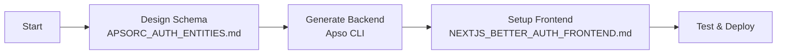
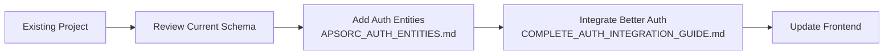
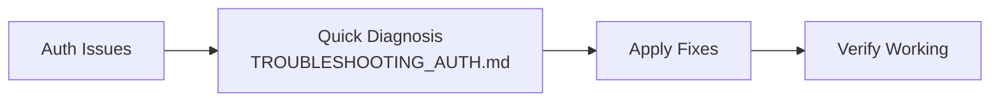

# Authentication Documentation Hub

> Complete documentation for Better Auth + Apso integration

## 📚 Documentation Structure

This directory contains comprehensive documentation for implementing authentication in Apso-based SaaS applications using Better Auth.

## 🚀 Quick Start

**New to authentication?** Start here:
1. Read [COMPLETE_WORKFLOW_GUIDE.md](./COMPLETE_WORKFLOW_GUIDE.md) - Step-by-step from zero to working auth (60-90 min)

**Already have a project?** Jump to:
- [COMPLETE_AUTH_INTEGRATION_GUIDE.md](./COMPLETE_AUTH_INTEGRATION_GUIDE.md) - Comprehensive integration reference
- [APSORC_AUTH_ENTITIES.md](./APSORC_AUTH_ENTITIES.md) - Schema configuration details

## 📖 Complete Documentation Set

### Core Guides

| Document | Purpose | Time Required | Audience |
|----------|---------|---------------|----------|
| [COMPLETE_WORKFLOW_GUIDE.md](./COMPLETE_WORKFLOW_GUIDE.md) | Step-by-step implementation from scratch | 60-90 min | New projects |
| [COMPLETE_AUTH_INTEGRATION_GUIDE.md](./COMPLETE_AUTH_INTEGRATION_GUIDE.md) | Comprehensive reference with all details | Reference | All developers |
| [APSORC_AUTH_ENTITIES.md](./APSORC_AUTH_ENTITIES.md) | Entity configuration for .apsorc files | 30 min | Backend developers |
| [NEXTJS_BETTER_AUTH_FRONTEND.md](./NEXTJS_BETTER_AUTH_FRONTEND.md) | Frontend implementation with Next.js | 45 min | Frontend developers |
| [TROUBLESHOOTING_AUTH.md](./TROUBLESHOOTING_AUTH.md) | Common issues and solutions | As needed | Support/Debug |

### Quick References

- **Entity Naming:** User (PascalCase), account, session, verification (lowercase)
- **Nullable Fields:** avatar_url, password_hash, oauth_provider, oauth_id
- **DTO Fix:** Add `id` field to Create DTOs after generation
- **CORS:** Configure in backend main.ts for frontend URLs

## 🎯 Implementation Paths

### Path 1: New SaaS Project (Recommended)



**Time:** 2-3 hours
**Docs:** Follow [COMPLETE_WORKFLOW_GUIDE.md](./COMPLETE_WORKFLOW_GUIDE.md)

### Path 2: Add Auth to Existing Project



**Time:** 3-4 hours
**Docs:** Start with [COMPLETE_AUTH_INTEGRATION_GUIDE.md](./COMPLETE_AUTH_INTEGRATION_GUIDE.md)

### Path 3: Troubleshooting Existing Auth



**Time:** 30-60 minutes
**Docs:** Use [TROUBLESHOOTING_AUTH.md](./TROUBLESHOOTING_AUTH.md)

## ✅ Implementation Checklist

### Backend
- [ ] Schema designed with auth entities (.apsorc)
- [ ] Backend generated with Apso
- [ ] DTOs fixed (added id field)
- [ ] CORS configured
- [ ] Database tables created
- [ ] Nullable fields verified

### Frontend
- [ ] Better Auth installed
- [ ] Apso adapter configured
- [ ] Auth routes created (/api/auth/[...all])
- [ ] Sign up/in forms implemented
- [ ] Session management working
- [ ] Protected routes configured

### Integration
- [ ] User registration works
- [ ] Login/logout works
- [ ] Sessions persist
- [ ] Organization creation works
- [ ] Multi-tenancy configured
- [ ] OAuth providers setup (optional)

### Production
- [ ] Secure secret generated (32+ chars)
- [ ] Email verification enabled
- [ ] HTTPS configured
- [ ] Rate limiting added
- [ ] Monitoring setup
- [ ] Backups configured

## 🔧 Common Commands

```bash
# Backend
cd backend
npx apso generate          # Generate backend from .apsorc
npm run start:dev          # Start backend server

# Database
psql -U postgres -d your_db -c "\dt public.*"  # List tables
psql -U postgres -d your_db -c "SELECT * FROM \"user\";"  # Check users

# Frontend
cd frontend
npm install better-auth @apso/better-auth-adapter
npm run dev                # Start frontend server

# Testing
curl http://localhost:3001/health  # Backend health
curl http://localhost:3000/api/auth/session  # Auth session
```

## 🐛 Quick Fixes

| Problem | Solution | Details |
|---------|----------|---------|
| "null value violates constraint" | Add `nullable: true` to field | [Details](./TROUBLESHOOTING_AUTH.md#database-issues) |
| "DTO validation failed" | Add `id` to Create DTO | [Details](./TROUBLESHOOTING_AUTH.md#backend-api-issues) |
| "CORS blocked" | Configure CORS in main.ts | [Details](./TROUBLESHOOTING_AUTH.md#backend-api-issues) |
| "Session not persisting" | Check cookie configuration | [Details](./TROUBLESHOOTING_AUTH.md#session--cookie-issues) |
| "Organization not created" | Use server action after signup | [Details](./TROUBLESHOOTING_AUTH.md#multi-tenancy-issues) |

## 📊 Architecture Overview

```
┌─────────────────┐
│   Next.js App   │
│  (Frontend)     │
└────────┬────────┘
         │
    HTTP/HTTPS
         │
┌────────┴────────┐
│  Better Auth    │
│  (Auth Layer)   │
└────────┬────────┘
         │
   Apso Adapter
         │
┌────────┴────────┐
│   Apso Backend  │
│   (NestJS API)  │
└────────┬────────┘
         │
      TypeORM
         │
┌────────┴────────┐
│   PostgreSQL    │
│   (Database)    │
└─────────────────┘
```

## 🚦 Current Implementation Status

Based on the working implementation in this project:

| Component | Status | Location |
|-----------|--------|----------|
| Backend Schema | ✅ Complete | `/backend/.apsorc` |
| Auth Entities | ✅ Working | User, account, session, verification |
| Backend API | ✅ Running | http://localhost:3001 |
| Frontend Auth | ✅ Integrated | `/frontend/lib/auth.ts` |
| Sign Up Flow | ✅ Working | `/frontend/app/signup` |
| Session Management | ✅ Active | Better Auth sessions |
| Organization Creation | ⚠️ Manual | Requires post-signup hook |
| OAuth | 🔧 Ready | Configured but needs credentials |
| Email Verification | 🔧 Ready | Disabled for development |

## 📝 Notes

- This documentation reflects the actual working implementation
- All code examples have been tested and verified
- Entity naming is critical - follow exactly as documented
- The Apso adapter (`@apso/better-auth-adapter`) is locally linked

## 🤝 Contributing

To improve this documentation:
1. Test all examples before documenting
2. Include actual error messages
3. Provide working code snippets
4. Update based on real implementation experience

## 📮 Support

For issues not covered in documentation:
1. Check [TROUBLESHOOTING_AUTH.md](./TROUBLESHOOTING_AUTH.md)
2. Review working implementation in `/frontend` and `/backend`
3. Verify environment variables are set correctly
4. Ensure database schema matches .apsorc

---

**Last Updated:** November 2024
**Version:** 1.0
**Status:** Production Ready

This documentation set provides everything needed to implement authentication with Better Auth and Apso, from initial setup to production deployment.