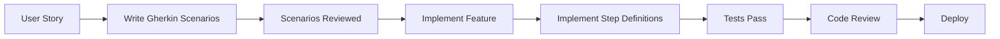

# Testing Methodology: BDD/Gherkin Approach

> Test-driven development using behavior specifications for comprehensive feature verification

---

## Core Philosophy

**Testing is not optional—it's how we validate delivery.**

Every feature must be:
1. **Specified** in Gherkin scenarios (what success looks like)
2. **Implemented** according to specifications
3. **Verified** through automated tests
4. **Traceable** from task to test to code

---

## BDD/Gherkin Testing Approach

### What is BDD?

Behavior-Driven Development (BDD) bridges the gap between business requirements and technical implementation by:
- Writing tests in plain English that non-developers can understand
- Defining acceptance criteria before writing code
- Creating living documentation that stays in sync with the system

### Gherkin Structure

```gherkin
Feature: Discovery Session Management
  As a product owner
  I want to create and manage discovery sessions
  So that I can track project ideation

  @smoke @api
  Scenario: Create a new discovery session
    Given I have a valid organization ID
    When I submit a discovery session with title "New Product Idea"
    Then a new session should be created with status "draft"
    And the response should include a session ID
    And the session should be linked to my organization
```

### Feature File Organization

```
features/
├── api/                    # Backend API tests
│   ├── auth/              # Authentication endpoints
│   ├── crud/              # CRUD operations
│   └── integrations/      # Third-party integrations
├── ui/                     # Frontend component tests
│   ├── components/        # Component-level tests
│   ├── pages/             # Page-level tests
│   └── forms/             # Form validations
└── e2e/                    # End-to-end workflows
    ├── user-journeys/     # Complete user flows
    ├── critical-paths/    # Business-critical paths
    └── smoke-tests/       # Quick verification suite
```

---

## When to Write Tests

### Test-First Development Flow



### Testing Timeline

| Phase | When to Write | What to Write | Why |
|-------|--------------|---------------|-----|
| **Planning** | Before sprint starts | Gherkin scenarios from user stories | Define acceptance criteria |
| **Development** | Before coding feature | Step definitions skeleton | Guide implementation |
| **Implementation** | During coding | Update scenarios as needed | Reflect reality |
| **Review** | Before PR merge | All tests passing | Ensure quality |
| **Deployment** | After merge | Smoke tests | Verify production |

### Progressive Test Development

```yaml
Week 1-2 (Foundation):
  - Write scenarios for core entities
  - Basic CRUD test coverage
  - API endpoint verification

Week 3-4 (Features):
  - UI component scenarios
  - Form validation tests
  - Integration scenarios

Week 5-6 (Polish):
  - E2E user journeys
  - Error handling scenarios
  - Performance benchmarks
```

---

## Test Structure Guidelines

### API Tests

**Purpose:** Verify backend endpoints, data validation, and business logic

```gherkin
@api @crud
Feature: Discovery Session API

  Background:
    Given the API server is running
    And I have a valid authentication token

  @create @smoke
  Scenario: Create session with all required fields
    Given I have a discovery session payload:
      | field         | value                |
      | title         | Product Ideation     |
      | description   | Initial brainstorm   |
      | organizationId| 1                   |
    When I send a POST request to "/api/discovery-sessions"
    Then the response status should be 201
    And the response should contain:
      | field  | type   |
      | id     | string |
      | title  | string |
      | status | string |
```

### UI Tests

**Purpose:** Verify component rendering, user interactions, and state management

```gherkin
@ui @forms
Feature: Discovery Session Form

  @validation @positive
  Scenario: Submit valid discovery session
    Given I am on the landing page
    When I fill in "Project Title" with "New SaaS Platform"
    And I fill in "Description" with "AI-powered analytics"
    And I click "Start Discovery Process"
    Then I should see "Session created successfully"
    And I should be redirected to "/sessions"

  @validation @negative
  Scenario: Validation prevents empty submission
    Given I am on the landing page
    When I click "Start Discovery Process"
    Then I should see "Title is required"
    And the form should not be submitted
```

### E2E Tests

**Purpose:** Verify complete user workflows across the entire system

```gherkin
@e2e @critical-path
Feature: Complete Discovery Flow

  @smoke
  Scenario: User creates and manages discovery session
    Given I am a logged-in user
    When I navigate to the homepage
    And I submit a new project idea "E-commerce Platform"
    Then I should see my idea in the sessions list
    When I click on my session
    Then I should see the session details
    And I should be able to update the status to "in_progress"
```

---

## Traceability Requirements

### Task to Test Mapping

Every development task MUST have corresponding test coverage:

```markdown
## Task: Implement user authentication

### Acceptance Criteria (Gherkin):
- Feature: User Authentication
  - Scenario: Successful login with email/password
  - Scenario: Failed login with incorrect password
  - Scenario: Account lockout after failed attempts

### Test Coverage:
- API: `features/api/auth/login.feature` (5 scenarios)
- UI: `features/ui/login-form.feature` (8 scenarios)
- E2E: `features/e2e/auth-flow.feature` (3 scenarios)

### Traceability:
- Task ID: TASK-001
- Test Files: 3
- Total Scenarios: 16
- Coverage: 100%
```

### Traceability Matrix Structure

```markdown
| Task | Feature File | Scenarios | Status |
|------|-------------|-----------|--------|
| Create login endpoint | api/auth/login.feature | 5 | ✅ |
| Build login form | ui/login-form.feature | 8 | ✅ |
| Add session management | api/auth/session.feature | 4 | ✅ |
| Password reset flow | e2e/password-reset.feature | 6 | ⏳ |
```

---

## Coverage Expectations

### What Needs Tests

#### Must Have Tests (100% Coverage Required)
- ✅ All API endpoints (CRUD + custom)
- ✅ Authentication & authorization flows
- ✅ Payment/billing operations
- ✅ Data validation rules
- ✅ Critical user paths (signup → purchase)
- ✅ Error handling & recovery
- ✅ Security boundaries

#### Should Have Tests (80% Coverage Target)
- ✅ UI component interactions
- ✅ Form submissions & validations
- ✅ State management changes
- ✅ Navigation flows
- ✅ Responsive design breakpoints

#### Nice to Have Tests (Best Effort)
- Visual regression tests
- Performance benchmarks
- Accessibility compliance
- Browser compatibility
- Localization

### What Doesn't Need Tests

#### Skip Testing For:
- ❌ Third-party library internals
- ❌ Framework boilerplate
- ❌ Simple getters/setters
- ❌ Console.log statements
- ❌ Development-only utilities
- ❌ Auto-generated code (unless customized)

---

## Test-First Development Workflow

### Step-by-Step Process

#### 1. Start with User Story
```markdown
As a user
I want to filter discovery sessions by status
So that I can focus on active projects
```

#### 2. Write Gherkin Scenarios
```gherkin
Scenario: Filter sessions by draft status
  Given I have sessions with different statuses
  When I select "Draft" from the status filter
  Then I should only see sessions with status "draft"
```

#### 3. Create Step Definition Skeleton
```typescript
Given('I have sessions with different statuses', async () => {
  // TODO: Create test data
});

When('I select {string} from the status filter', async (status) => {
  // TODO: Implement filter interaction
});

Then('I should only see sessions with status {string}', async (status) => {
  // TODO: Verify filtered results
});
```

#### 4. Run Test (Expect Failure)
```bash
npm test -- --tags "@filter"
# ❌ 0 of 1 scenario passing
```

#### 5. Implement Feature
```typescript
// Implement the actual filtering logic
const filterSessions = (sessions, status) => {
  return sessions.filter(s => s.status === status);
};
```

#### 6. Complete Step Definitions
```typescript
Given('I have sessions with different statuses', async () => {
  await createSession({ status: 'draft' });
  await createSession({ status: 'in_progress' });
  await createSession({ status: 'completed' });
});
```

#### 7. Verify Tests Pass
```bash
npm test -- --tags "@filter"
# ✅ 1 of 1 scenario passing
```

---

## Integration with Progressive Delivery

### Phase-Based Testing Strategy

#### Phase 1: Foundation (Weeks 1-2)
**Focus:** Basic functionality and API contracts

```yaml
Required Tests:
  - API CRUD operations (18+ scenarios)
  - Basic UI rendering (10+ scenarios)
  - Database connections (5+ scenarios)

Deliverables:
  - features/api/*.feature files
  - Basic step definitions
  - Test data factories
```

#### Phase 2: User Features (Weeks 3-4)
**Focus:** User interactions and workflows

```yaml
Required Tests:
  - Form validations (15+ scenarios)
  - User authentication (12+ scenarios)
  - Navigation flows (8+ scenarios)

Deliverables:
  - features/ui/*.feature files
  - Page object models
  - Mock data providers
```

#### Phase 3: Integration (Weeks 5-6)
**Focus:** End-to-end workflows and error handling

```yaml
Required Tests:
  - Complete user journeys (10+ scenarios)
  - Error recovery (8+ scenarios)
  - Performance benchmarks (5+ scenarios)

Deliverables:
  - features/e2e/*.feature files
  - Performance baselines
  - CI/CD integration
```

---

## Example: Lightbulb Project Testing

### Phase 1 Test Deliverables

```gherkin
# features/api/discovery-sessions-crud.feature
Feature: Discovery Session CRUD Operations

  @smoke @api
  Scenario: Create a new discovery session
    Given I have a valid organization ID of 1
    When I create a discovery session with:
      | title       | AI-Powered Analytics Platform |
      | description | Building next-gen analytics   |
    Then the session should be created successfully
    And the response should include all session fields
```

```gherkin
# features/ui/landing-page-submission.feature
Feature: Landing Page Project Submission

  @smoke @ui
  Scenario: Submit project idea from landing page
    Given I am on the landing page
    When I enter "SaaS Boilerplate" as the project title
    And I enter "Accelerate SaaS development" as the description
    And I click "Get Started"
    Then I should see "Discovery session created!"
    And I should see a link to view all sessions
```

```gherkin
# features/e2e/discovery-flow-phase1.feature
Feature: Phase 1 Discovery Flow

  @critical-path @e2e
  Scenario: Complete Phase 1 user journey
    Given I visit the application
    When I submit a new project idea
    Then I should see it in my sessions list
    And all data should be persisted correctly
```

### Test Execution Commands

```bash
# Run all Phase 1 tests
npm test -- --tags "@phase1"

# Run smoke tests only
npm test -- --tags "@smoke"

# Run API tests
npm test -- features/api/**/*.feature

# Run with coverage report
npm test -- --coverage --tags "@phase1"

# Generate traceability report
npm run test:traceability
```

---

## Testing Checklist

### Before Development
- [ ] User story has clear acceptance criteria
- [ ] Gherkin scenarios written and reviewed
- [ ] Test files created in correct location
- [ ] Tags applied appropriately

### During Development
- [ ] Step definitions implemented incrementally
- [ ] Tests run locally after each change
- [ ] Edge cases added as discovered
- [ ] Mock data realistic and varied

### Before Merge
- [ ] All scenarios passing (100% green)
- [ ] No skipped tests without justification
- [ ] Coverage thresholds met (>80%)
- [ ] Traceability matrix updated
- [ ] CI pipeline passing

### After Deployment
- [ ] Smoke tests run in production
- [ ] Performance benchmarks validated
- [ ] Error monitoring configured
- [ ] User acceptance verified

---

## Benefits of This Approach

### For Developers
- 🎯 Clear acceptance criteria before coding
- 🔄 Rapid feedback on implementation
- 📝 Tests serve as documentation
- 🛡️ Confidence in refactoring

### For Product Owners
- 👁️ Visibility into what's being built
- ✅ Verification that requirements are met
- 📊 Clear progress tracking
- 🔍 Traceability from requirement to test

### For QA Teams
- 🤖 Automated regression testing
- 📋 Living documentation of system behavior
- 🎭 Scenarios readable by non-technical stakeholders
- 🔄 Continuous validation of features

---

## Quick Reference

### File Naming Convention
```
features/
├── [layer]/[feature]/[operation].feature
│   api/auth/login.feature
│   ui/forms/validation.feature
│   e2e/user-journeys/onboarding.feature
```

### Tag Taxonomy
```gherkin
@layer:     @api | @ui | @e2e
@priority:  @smoke | @critical | @regression
@type:      @positive | @negative | @edge-case
@feature:   @auth | @payment | @crud
@phase:     @phase1 | @phase2 | @phase3
```

### Common Step Patterns
```gherkin
# API Steps
Given I have a valid [resource] payload
When I send a [METHOD] request to "[endpoint]"
Then the response status should be [code]

# UI Steps
Given I am on the [page name] page
When I [action] "[element]"
Then I should see "[message]"

# E2E Steps
Given I am a [user type]
When I complete the [workflow name] process
Then the system should [expected outcome]
```

---

**Version:** 1.0
**Created:** 2025-01-13
**Framework:** BDD/Gherkin with Cucumber
**Status:** Production-ready methodology